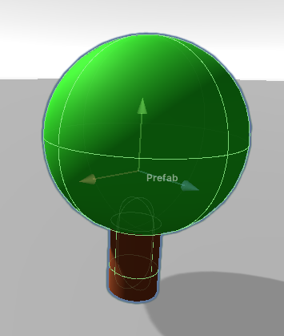
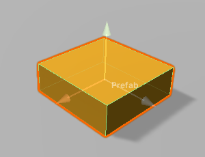

# ApplePicker Game Micro-GDD

- Create a Unity Project (3D Core)

## Game Objects Needed

- Simple
  - [Ground](#ground)
- Prefabs
  - [Apple Tree](#apple-tree)
  - [Apple](#apple)
  - [Basket](#basket)

## Making rough assets quickly in Unity

### Ground

1. Object Hierarchy
   - Ground (plane)
2. Materials
   1. Ground (green grass color)

### Apple Tree

1. Object Hierarchy
   - AppleTree (empty): tag "AppleTree"
     - Trunk (cylinder)
     - Leaves (sphere)
2. Materials
   1. AppleTreeTrunk (dark brown color)
   2. AppleTreeLeaves (green leaf color)
3. Behaviours
   - Every frame, move
   - On 10% chance or when hitting the side of the scene, change direction
   - On time to drop, drop an apple

### Apple

1. Object Hierarchy
   - Apple (sphere): tag "Apple"
2. Materials
   1. Apple (bright red color)

### Basket

1. Object Hierarchy
   - Basket (cube): tag "Basket"
2. Materials
   1. Basket (gold/orange color)

## Camera

- Projection: orthographic
- Size: 4

This will result in the following calculations:

- Height: 2 * (size) = 8 m
- Width: (aspect ratio) * (height) = (aspect ratio) * 8 m
  - For 16:10, (width) = 12.8 m
  - For 16:9, (width) = 14.2 m
